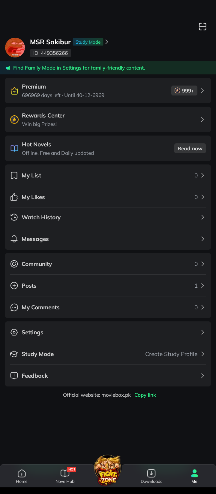
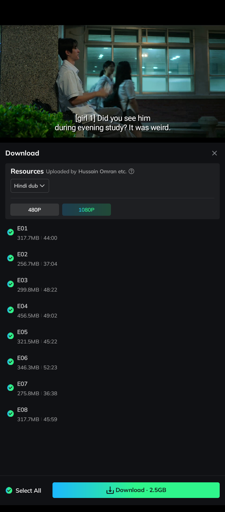

  
  
  <h2>What is MovieBox Mod?</h2>
  
MovieBox is a popular third-party streaming application for Android, Windows, and Firestick that allows users to watch and download a vast library of movies, TV series, anime, and live content.

<b> Mod features: New Icon, Premium Unlocked,1080p+ streaming and download,No ads</b>

  
  

    If you find this project useful, please consider giving this repository a star (⭐).
  

 

<table width="100%">
  <tr>
    <th align="left" width="50%">App Name</th>
    <th align="center" width="50%">MovieBox Mod</th>
  </tr>
  <tr>
    <td align="left"><b>App version</b></td>
    <td align="center">3.0.15.0429.03</td>
  </tr>
  <tr>
    <td align="left"><b>Requirement</b></td>
    <td align="center">5.0 and above</td>
  </tr>
  <tr>
    <td align="left"><b>Mod By</b></td>
    <td align="center"><a href="https://facebook.com/sakibur.msr">MSR Sakibur</a></td>
  </tr>
  <tr>
    <td align="left"><b>Size</b></td>
    <td align="center">50MB+</td>
  </tr>
  <tr>
    <td align="left"><b>Category</b></td>
    <td align="center">Entertainment</td>
  </tr>
  <tr>
    <td align="left"><b>Visitors</b></td>
    <td align="center"></td>
  </tr>
  <tr>
    <td align="left"><b>Last Update</b></td>
    <td align="center">06 May 2026</td>
  </tr>
  <tr>
    <td align="left"><b>Number of Downloads</b></td>
    <td align="center"></td>
  </tr>
  <tr>
    <td align="left"><b>Price</b></td>
    <td align="center">Free</td>
  </tr>
  <tr>
    <td colspan="2" align="center">
       
      
      
    </td>
  </tr>
</table>

   
  
    

## Join Community:

| MSR PatcH Discussion | MSR PatcH (Main Channel) |
| :---: | :---: |
|  |  |

  

